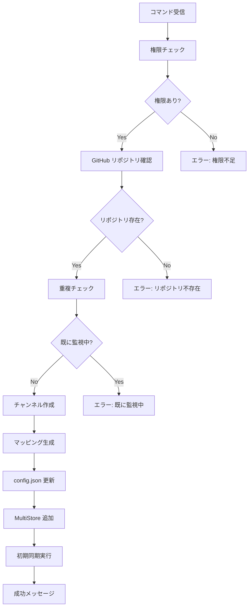

# Discord コマンドによる自動リポジトリ監視機能 実装計画書

## 📋 概要

Discord のスラッシュコマンドを使用して、GitHub リポジトリの監視を動的に開始・停止できる機能を実装します。

### 主な機能
- `/watch` コマンドでリポジトリ監視を開始
- 指定カテゴリ下に自動的にフォーラムチャンネルを作成
- config.json への自動保存
- ボット再起動不要での即時反映

## 🎯 実装目標

### できるようになること
- Discord から直接リポジトリ監視を設定
- チャンネルの自動作成と整理
- 既存 Issue の自動同期

### できないこと（スコープ外）
- 動的なチャンネル名のカスタマイズ
- カテゴリの自動作成
- 複雑な権限管理

## 🏗️ アーキテクチャ

### 新規作成ファイル構成

```
src/
├── commands/
│   ├── CommandRegistry.ts      # コマンド登録・管理
│   ├── WatchCommand.ts         # /watch コマンド
│   ├── UnwatchCommand.ts       # /unwatch コマンド
│   └── ListCommand.ts          # /list コマンド
├── managers/
│   ├── DynamicMappingManager.ts # 動的マッピング管理
│   └── ConfigPersistence.ts     # config.json 安全更新
└── types/
    └── commandTypes.ts          # コマンド関連の型定義
```

### 修正対象ファイル

- `src/index.ts` - コマンドハンドラー初期化追加
- `src/store/MultiStore.ts` - 動的追加/削除メソッド
- `src/config/ConfigManager.ts` - 設定更新メソッド
- `config.json` - forum_category_id フィールド追加

## 📝 実装仕様

### コマンド定義

#### `/watch`
```
説明: GitHub リポジトリの監視を開始
パラメータ:
  - owner (必須): リポジトリオーナー
  - repo (必須): リポジトリ名
権限: 管理者のみ
```

#### `/unwatch`
```
説明: GitHub リポジトリの監視を停止
パラメータ:
  - owner (必須): リポジトリオーナー
  - repo (必須): リポジトリ名
  - delete_channel (オプション): チャンネルも削除するか
権限: 管理者のみ
```

#### `/list`
```
説明: 監視中のリポジトリ一覧を表示
パラメータ: なし
権限: 全員
```

### 処理フロー

#### 監視開始フロー



### データ構造

#### config.json 追加フィールド
```json
{
  "forum_category_id": "1234567890123456789",
  "command_settings": {
    "admin_role_id": "1234567890123456789",
    "enable_auto_sync": true,
    "sync_limit": 50
  }
}
```

#### 自動生成マッピング
```json
{
  "id": "owner-repo-20250807120000",
  "channel_id": "1234567890123456789",
  "repository": {
    "owner": "owner",
    "name": "repo"
  },
  "enabled": true,
  "created_at": "2025-08-07T12:00:00Z",
  "created_by": "user_discord_id"
}
```

## 🚨 エラーハンドリング

| エラーケース | 対応 | メッセージ |
|-------------|------|-----------|
| カテゴリ未設定 | 処理中断 | ❌ カテゴリIDが設定されていません |
| リポジトリ不存在 | 処理中断 | ❌ リポジトリが見つかりません |
| 既に監視中 | 処理中断 | ⚠️ 既に監視中です |
| チャンネル作成失敗 | ロールバック | ❌ チャンネル作成に失敗しました |
| config.json 更新失敗 | リトライ後ロールバック | ❌ 設定の保存に失敗しました |

## 📊 実装優先順位

### Phase 1: 基本機能（必須）
- [ ] CommandRegistry の実装
- [ ] /watch コマンドの基本実装
- [ ] DynamicMappingManager の実装
- [ ] ConfigPersistence の実装
- [ ] MultiStore の拡張

### Phase 2: 運用機能
- [ ] /unwatch コマンドの実装
- [ ] /list コマンドの実装
- [ ] エラーハンドリングの強化
- [ ] ログ出力の充実

### Phase 3: 改善
- [ ] 初期同期の進捗表示
- [ ] バッチ処理対応
- [ ] 設定のエクスポート/インポート

## 🧪 テスト項目

### 基本動作確認
- [ ] /watch でチャンネル作成される
- [ ] 監視が即座に開始される
- [ ] 既存 Issue が同期される
- [ ] /unwatch で監視が停止する
- [ ] ボット再起動後も設定が維持される

### エラーケース確認
- [ ] 権限不足時のエラー表示
- [ ] 存在しないリポジトリのエラー
- [ ] 重複登録のエラー
- [ ] カテゴリ未設定時のエラー

## ⚠️ リスクと対策

### 技術的リスク
- **config.json の破損**
  - 対策: 書き込み前バックアップ、トランザクション的更新
- **Discord API レート制限**
  - 対策: 適切な待機時間、エラーハンドリング
- **大量 Issue の初期同期**
  - 対策: 同期数制限（デフォルト50件）、非同期処理

### 運用リスク
- **誤った監視設定**
  - 対策: /list での確認機能、/unwatch での削除
- **チャンネル数の増大**
  - 対策: カテゴリ容量の監視、定期的な整理

## 📅 実装スケジュール

```
Day 1-2: Phase 1 実装（基本機能）
Day 3:   Phase 2 実装（運用機能）
Day 4:   テストとバグ修正
Day 5:   ドキュメント作成
```

## 📈 成功指標

- **パフォーマンス**: コマンド実行から監視開始まで 10 秒以内
- **信頼性**: エラー率 1% 未満
- **使いやすさ**: 追加ドキュメント不要で使える

## 🔧 実装時の注意点

1. **config.json の更新は必ずロック機構を使用**
2. **Discord API の呼び出しは適切なエラーハンドリング**
3. **GitHub API のレート制限を考慮**
4. **ユーザーへのフィードバックは Embed で見やすく**

---

**作成日**: 2025-08-07  
**最終更新**: 2025-08-07  
**ステータス**: 計画中