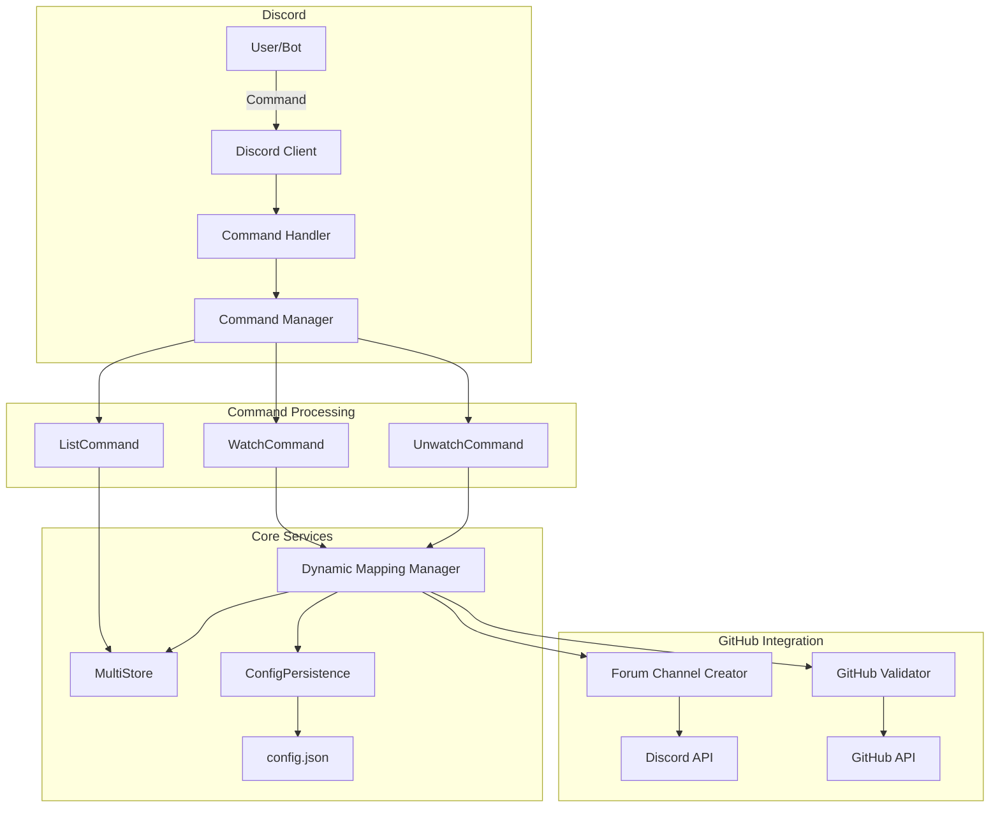

# Discord コマンド機能 設計書

## 概要

この設計書は、GitHub Issues Discord Threads Bot に Discord コマンド機能を追加するための技術設計を定義します。スラッシュコマンドとプレフィックスコマンドの両方をサポートし、動的なリポジトリ監視管理を実現します。

## アーキテクチャ

### 全体構成



### レイヤード アーキテクチャ

```
┌─────────────────────────────────────────┐
│         プレゼンテーション層            │
│   (Discord Commands & Messages)         │
├─────────────────────────────────────────┤
│           コマンド処理層                 │
│   (Command Handlers & Registry)         │
├─────────────────────────────────────────┤
│           ビジネスロジック層             │
│  (Dynamic Mapping & Sync Manager)       │
├─────────────────────────────────────────┤
│           データ管理層                   │
│   (MultiStore & ConfigPersistence)      │
├─────────────────────────────────────────┤
│          インフラストラクチャ層          │
│     (File System & Discord/GitHub API)  │
└─────────────────────────────────────────┘
```

## コンポーネントと インターフェース

### 1. CommandManager

```typescript
interface CommandManager {
  // スラッシュコマンドの登録
  registerSlashCommands(client: Client): Promise<void>;
  
  // プレフィックスコマンドの処理
  handlePrefixCommand(message: Message): Promise<void>;
  
  // コマンドの実行
  executeCommand(
    commandName: string,
    args: CommandArgs,
    context: CommandContext
  ): Promise<CommandResult>;
}

interface CommandContext {
  type: 'slash' | 'prefix';
  user: User;
  channel: TextChannel | ForumChannel;
  guild: Guild;
  message?: Message;
  interaction?: ChatInputCommandInteraction;
}

interface CommandArgs {
  owner?: string;
  repo?: string;
  deleteChannel?: boolean;
}

interface CommandResult {
  success: boolean;
  message: string;
  embed?: EmbedBuilder;
  error?: Error;
}
```

### 2. Command Base クラス

```typescript
abstract class BaseCommand {
  abstract name: string;
  abstract description: string;
  abstract execute(
    args: CommandArgs,
    context: CommandContext,
    services: CommandServices
  ): Promise<CommandResult>;
  
  // 共通のエラーハンドリング
  protected handleError(error: Error): CommandResult {
    return {
      success: false,
      message: `エラーが発生しました: ${error.message}`,
      error
    };
  }
  
  // 応答の送信
  protected async sendResponse(
    context: CommandContext,
    result: CommandResult
  ): Promise<void> {
    if (context.type === 'slash' && context.interaction) {
      await context.interaction.reply({
        content: result.message,
        embeds: result.embed ? [result.embed] : []
      });
    } else if (context.message) {
      await context.message.reply({
        content: result.message,
        embeds: result.embed ? [result.embed] : []
      });
    }
  }
}

interface CommandServices {
  multiStore: MultiStore;
  mappingManager: DynamicMappingManager;
  githubFactory: GitHubClientFactory;
  discordClient: Client;
}
```

### 3. DynamicMappingManager

```typescript
interface DynamicMappingManager {
  // マッピングの追加
  addMapping(
    owner: string,
    repo: string,
    categoryId: string,
    userId: string
  ): Promise<MappingResult>;
  
  // マッピングの削除
  removeMapping(
    owner: string,
    repo: string,
    deleteChannel: boolean
  ): Promise<void>;
  
  // マッピング一覧の取得
  getAllMappings(): RepositoryMapping[];
  
  // リポジトリの検証
  validateRepository(owner: string, repo: string): Promise<boolean>;
  
  // フォーラムチャンネルの作成
  createForumChannel(
    guild: Guild,
    categoryId: string,
    owner: string,
    repo: string
  ): Promise<ForumChannel>;
  
  // 初期同期の実行
  syncExistingIssues(
    mapping: RepositoryMapping,
    forumChannel: ForumChannel
  ): Promise<SyncResult>;
}

interface MappingResult {
  mapping: RepositoryMapping;
  channelId: string;
  syncResult?: SyncResult;
}

interface SyncResult {
  total: number;
  synced: number;
  errors: number;
  skipped: number;
}
```

### 4. ConfigPersistence

```typescript
interface ConfigPersistence {
  // 設定の読み込み
  loadConfig(): Promise<BotConfig>;
  
  // 設定の保存（ファイルロック付き）
  saveConfig(config: BotConfig): Promise<void>;
  
  // マッピングの追加
  addMapping(mapping: RepositoryMapping): Promise<void>;
  
  // マッピングの削除
  removeMapping(mappingId: string): Promise<void>;
  
  // バックアップの作成
  createBackup(): Promise<string>;
  
  // ロールバック
  rollback(backupPath: string): Promise<void>;
}

// ファイルロック機構
class FileLock {
  private static locks = new Map<string, Promise<void>>();
  
  static async withLock<T>(
    filePath: string,
    operation: () => Promise<T>
  ): Promise<T> {
    const currentLock = this.locks.get(filePath);
    if (currentLock) {
      await currentLock;
    }
    
    let resolve: () => void;
    const newLock = new Promise<void>(r => resolve = r);
    this.locks.set(filePath, newLock);
    
    try {
      return await operation();
    } finally {
      resolve!();
      this.locks.delete(filePath);
    }
  }
}
```

## データモデル

### 拡張された RepositoryMapping

```typescript
interface RepositoryMapping {
  id: string;                    // 一意のID (例: "microsoft-vscode-20250808120000")
  channel_id: string;             // Discord フォーラムチャンネルID
  repository: {
    owner: string;
    name: string;
  };
  enabled: boolean;               // 監視の有効/無効
  created_at: string;             // 作成日時 (ISO 8601)
  created_by?: string;            // 作成者のDiscord ユーザーID
  auto_synced?: boolean;          // 初期同期の完了フラグ
  tags?: {                        // タグマッピング（オプション）
    [labelName: string]: string;  // GitHub label → Discord tag ID
  };
}
```

### 拡張された BotConfig

```typescript
interface BotConfig {
  // 既存のフィールド
  discord_token: string;
  github_access_token: string;
  webhook_port?: number;
  webhook_path?: string;
  health_check_interval?: number;
  
  // 新規追加フィールド
  forum_category_id?: string;     // フォーラムチャンネルを作成するカテゴリID
  command_settings?: {
    enable_auto_sync: boolean;    // 監視開始時の自動同期
    prefix: string;                // プレフィックスコマンドの接頭辞（デフォルト: "!"）
  };
  
  // 既存のマッピング配列
  mappings: RepositoryMapping[];
}
```

## エラーハンドリング

### エラー分類と対処

```typescript
enum CommandErrorType {
  INVALID_ARGS = 'INVALID_ARGS',
  REPO_NOT_FOUND = 'REPO_NOT_FOUND',
  ALREADY_WATCHING = 'ALREADY_WATCHING',
  NOT_WATCHING = 'NOT_WATCHING',
  CHANNEL_CREATE_FAILED = 'CHANNEL_CREATE_FAILED',
  CONFIG_UPDATE_FAILED = 'CONFIG_UPDATE_FAILED',
  RATE_LIMITED = 'RATE_LIMITED',
  NO_CATEGORY = 'NO_CATEGORY',
  UNKNOWN = 'UNKNOWN'
}

class CommandError extends Error {
  constructor(
    public type: CommandErrorType,
    message: string,
    public originalError?: Error
  ) {
    super(message);
  }
  
  toUserMessage(): string {
    const messages: Record<CommandErrorType, string> = {
      INVALID_ARGS: '❌ コマンドの形式が正しくありません',
      REPO_NOT_FOUND: '❌ 指定されたリポジトリが見つかりません',
      ALREADY_WATCHING: '⚠️ このリポジトリは既に監視中です',
      NOT_WATCHING: '⚠️ このリポジトリは監視されていません',
      CHANNEL_CREATE_FAILED: '❌ チャンネルの作成に失敗しました',
      CONFIG_UPDATE_FAILED: '❌ 設定の保存に失敗しました',
      RATE_LIMITED: '⏳ API制限に達しました。しばらく待ってから再試行してください',
      NO_CATEGORY: '❌ フォーラムカテゴリが設定されていません',
      UNKNOWN: '❌ 予期しないエラーが発生しました'
    };
    return messages[this.type] || messages.UNKNOWN;
  }
}
```

### リトライとロールバック戦略

```typescript
class RetryStrategy {
  static async withRetry<T>(
    operation: () => Promise<T>,
    maxRetries: number = 3,
    backoff: number = 1000
  ): Promise<T> {
    let lastError: Error;
    
    for (let i = 0; i < maxRetries; i++) {
      try {
        return await operation();
      } catch (error) {
        lastError = error as Error;
        if (i < maxRetries - 1) {
          await this.delay(backoff * Math.pow(2, i));
        }
      }
    }
    
    throw lastError!;
  }
  
  private static delay(ms: number): Promise<void> {
    return new Promise(resolve => setTimeout(resolve, ms));
  }
}

class TransactionManager {
  private operations: Array<() => Promise<void>> = [];
  private rollbacks: Array<() => Promise<void>> = [];
  
  addOperation(
    operation: () => Promise<void>,
    rollback: () => Promise<void>
  ): void {
    this.operations.push(operation);
    this.rollbacks.push(rollback);
  }
  
  async execute(): Promise<void> {
    const completedOps: number[] = [];
    
    try {
      for (let i = 0; i < this.operations.length; i++) {
        await this.operations[i]();
        completedOps.push(i);
      }
    } catch (error) {
      // ロールバック実行
      for (const index of completedOps.reverse()) {
        try {
          await this.rollbacks[index]();
        } catch (rollbackError) {
          logger.error('Rollback failed', rollbackError as Error);
        }
      }
      throw error;
    }
  }
}
```

## テスト戦略

### ユニットテスト

```typescript
// コマンドハンドラーのテスト例
describe('WatchCommand', () => {
  let command: WatchCommand;
  let mockServices: CommandServices;
  
  beforeEach(() => {
    mockServices = createMockServices();
    command = new WatchCommand();
  });
  
  it('should create mapping for valid repository', async () => {
    const args = { owner: 'microsoft', repo: 'vscode' };
    const context = createMockContext();
    
    mockServices.mappingManager.validateRepository = jest.fn()
      .mockResolvedValue(true);
    
    const result = await command.execute(args, context, mockServices);
    
    expect(result.success).toBe(true);
    expect(result.message).toContain('監視を開始しました');
  });
  
  it('should reject invalid repository', async () => {
    const args = { owner: 'invalid', repo: 'repo' };
    const context = createMockContext();
    
    mockServices.mappingManager.validateRepository = jest.fn()
      .mockResolvedValue(false);
    
    const result = await command.execute(args, context, mockServices);
    
    expect(result.success).toBe(false);
    expect(result.message).toContain('リポジトリが見つかりません');
  });
});
```

### 統合テスト

```typescript
describe('Command Integration', () => {
  let bot: Bot;
  let testGuild: Guild;
  
  beforeAll(async () => {
    bot = new Bot();
    await bot.start();
    testGuild = await createTestGuild();
  });
  
  afterAll(async () => {
    await cleanupTestGuild(testGuild);
    await bot.shutdown();
  });
  
  it('should handle full watch/unwatch cycle', async () => {
    // 1. watchコマンド実行
    const watchResult = await executeCommand(
      '!watch microsoft typescript',
      testGuild
    );
    expect(watchResult).toContain('監視を開始');
    
    // 2. listコマンドで確認
    const listResult = await executeCommand('!list', testGuild);
    expect(listResult).toContain('microsoft/typescript');
    
    // 3. unwatchコマンド実行
    const unwatchResult = await executeCommand(
      '!unwatch microsoft typescript',
      testGuild
    );
    expect(unwatchResult).toContain('監視を停止');
  });
});
```

## パフォーマンス最適化

### 非同期処理とキューイング

```typescript
class SyncQueue {
  private queue: Array<() => Promise<void>> = [];
  private processing = false;
  
  async add(task: () => Promise<void>): Promise<void> {
    this.queue.push(task);
    if (!this.processing) {
      await this.process();
    }
  }
  
  private async process(): Promise<void> {
    this.processing = true;
    
    while (this.queue.length > 0) {
      const task = this.queue.shift()!;
      try {
        await task();
      } catch (error) {
        logger.error('Queue task failed', error as Error);
      }
    }
    
    this.processing = false;
  }
}
```

### API レート制限の管理

```typescript
class RateLimiter {
  private requests: number[] = [];
  private readonly limit: number;
  private readonly window: number; // ミリ秒
  
  constructor(limit: number, windowMinutes: number) {
    this.limit = limit;
    this.window = windowMinutes * 60 * 1000;
  }
  
  async checkLimit(): Promise<boolean> {
    const now = Date.now();
    this.requests = this.requests.filter(t => now - t < this.window);
    
    if (this.requests.length >= this.limit) {
      return false;
    }
    
    this.requests.push(now);
    return true;
  }
  
  getResetTime(): Date {
    if (this.requests.length === 0) {
      return new Date();
    }
    const oldest = Math.min(...this.requests);
    return new Date(oldest + this.window);
  }
}
```

## セキュリティ考慮事項

### 入力検証

```typescript
class InputValidator {
  static validateRepoOwner(owner: string): boolean {
    // GitHub のユーザー名/組織名の規則
    const pattern = /^[a-zA-Z0-9](?:[a-zA-Z0-9-]{0,37}[a-zA-Z0-9])?$/;
    return pattern.test(owner);
  }
  
  static validateRepoName(name: string): boolean {
    // GitHub のリポジトリ名の規則
    const pattern = /^[a-zA-Z0-9._-]{1,100}$/;
    return pattern.test(name);
  }
  
  static sanitizeInput(input: string): string {
    // 基本的なサニタイゼーション
    return input.trim().replace(/[<>]/g, '');
  }
}
```

## 実装の優先順位

### Phase 1: 基本機能
1. CommandManager の実装
2. BaseCommand クラスの実装
3. WatchCommand の実装
4. DynamicMappingManager の基本実装
5. ConfigPersistence の実装

### Phase 2: 完全な機能セット
1. UnwatchCommand の実装
2. ListCommand の実装
3. 初期同期機能の実装
4. エラーハンドリングの強化

### Phase 3: 最適化と改善
1. レート制限の実装
2. キューイングシステムの実装
3. 詳細なログとメトリクス
4. パフォーマンス最適化

## 移行計画

### 既存システムとの統合

1. **既存のBotクラスへの統合**
   - CommandManager を Bot クラスに追加
   - messageCreate イベントハンドラーを拡張
   - クライアント初期化時にスラッシュコマンドを登録

2. **MultiStore の拡張**
   - 動的な追加/削除メソッドを実装
   - 実行時の更新をサポート

3. **ConfigManager の拡張**
   - 設定の動的更新メソッドを追加
   - ファイルロック機構の実装

### 下位互換性の維持

- 既存のマッピング形式との互換性を維持
- 新しいフィールドはオプショナルとして追加
- 段階的な機能追加により既存の動作に影響を与えない

## 監視とログ

### ログレベルと内容

```typescript
// コマンド実行のログ
logger.info('Command executed', {
  command: commandName,
  user: userId,
  guild: guildId,
  args: sanitizedArgs,
  result: result.success
});

// エラーログ
logger.error('Command failed', {
  command: commandName,
  error: error.message,
  stack: error.stack,
  context: contextInfo
});

// メトリクスログ
logger.info('Sync completed', {
  mapping: mappingId,
  issuesSynced: count,
  duration: durationMs,
  errors: errorCount
});
```

### ヘルスチェック拡張

```typescript
interface CommandHealthMetrics {
  commandsExecuted: number;
  commandsSucceeded: number;
  commandsFailed: number;
  averageResponseTime: number;
  lastCommandTime: Date;
  activeSync: number;
}
```

## まとめ

この設計により、Discord コマンドを通じた動的なリポジトリ監視管理が可能になります。既存のアーキテクチャに統合しながら、拡張性とメンテナンス性を確保した実装を目指します。