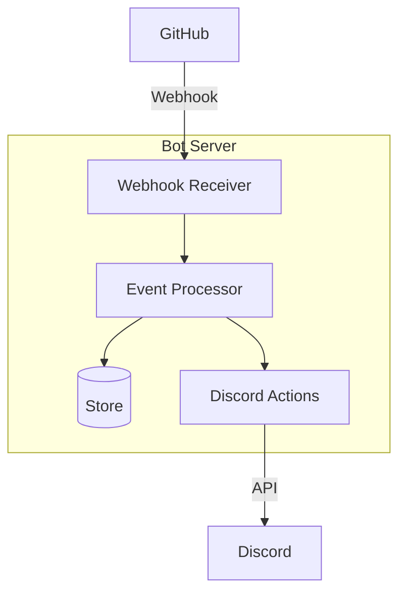
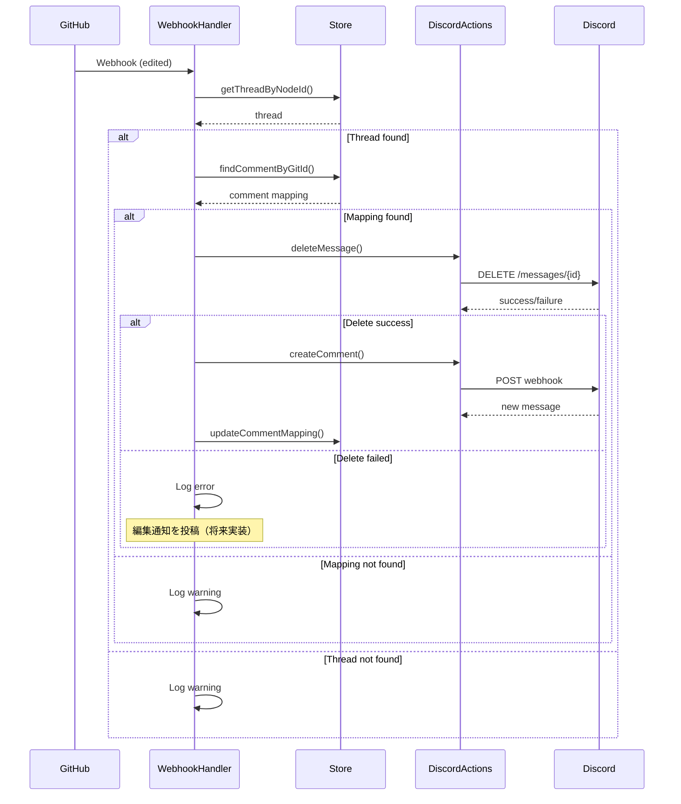
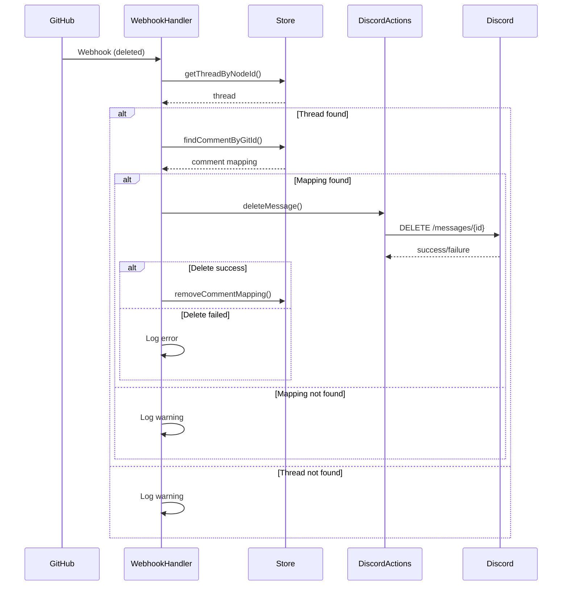

# GitHub コメント同期機能 設計書

## Overview

このドキュメントは、GitHub Issues のコメント編集・削除イベントを Discord に同期する機能の設計を定義します。現在、コメント作成の同期は実装済みですが、編集・削除の同期が未実装のため、これらの機能を追加します。

技術的制約として、Discord Webhook で投稿されたメッセージは編集不可能なため、編集時は「削除＋新規投稿」の方式を採用します。

## Architecture

### システム全体図



### コンポーネント構成

```
src/
├── webhook/
│   └── GitHubWebhookHandlers.ts  # Webhookイベント処理
├── discord/
│   └── DiscordActions.ts         # Discord API操作
├── store/
│   └── EnhancedStore.ts          # データストア管理
└── types/
    └── contextTypes.ts            # 型定義
```

## Components and Interfaces

### GitHubWebhookHandlers コンポーネント

#### 責務
- GitHub Webhook イベントの受信と処理
- 適切なアクションの実行指示

#### インターフェース

```typescript
class GitHubWebhookHandlers {
  /**
   * コメント編集イベントを処理
   */
  async handleIssueCommentEdited(
    context: MappingContext,
    payload: WebhookPayload
  ): Promise<void>

  /**
   * コメント削除イベントを処理
   */
  async handleIssueCommentDeleted(
    context: MappingContext,
    payload: WebhookPayload
  ): Promise<void>
}
```

### DiscordActions コンポーネント

#### 責務
- Discord API との通信
- メッセージの作成、削除操作

#### インターフェース

```typescript
class DiscordActions {
  /**
   * Discord メッセージを削除
   * @returns 削除成功の可否
   */
  async deleteMessage(
    context: MappingContext,
    messageId: string,
    channelId: string
  ): Promise<boolean>

  /**
   * 既存の createComment メソッドを活用
   * Webhook 経由で新しいメッセージを投稿
   */
  async createComment(
    context: MappingContext,
    data: CommentData
  ): Promise<void>
}
```

### EnhancedStore コンポーネント

#### 責務
- コメントマッピングの管理
- Thread データの永続化

#### インターフェース

```typescript
interface EnhancedStore {
  /**
   * GitHub コメントIDから Discord メッセージを検索
   */
  findCommentByGitId(
    threadId: string,
    gitId: number
  ): Comment | undefined

  /**
   * コメントマッピングを更新
   */
  updateCommentMapping(
    threadId: string,
    gitId: number,
    newMessageId: string
  ): void

  /**
   * コメントマッピングを削除
   */
  removeCommentMapping(
    threadId: string,
    gitId: number
  ): void
}
```

## Data Models

### Webhook ペイロード

```typescript
// コメント編集時
interface EditedCommentPayload {
  action: "edited"
  comment: {
    id: number
    body: string
    user: {
      login: string
      avatar_url: string
    }
  }
  issue: {
    number: number
    node_id: string
  }
}

// コメント削除時
interface DeletedCommentPayload {
  action: "deleted"
  comment: {
    id: number
  }
  issue: {
    number: number
    node_id: string
  }
}
```

### コメントマッピング

```typescript
interface Comment {
  id: string      // Discord message ID
  git_id: number  // GitHub comment ID
}

interface Thread {
  id: string
  number?: number
  node_id?: string
  comments: Comment[]
  // ... other fields
}
```

## Error Handling

### エラーケースと処理方法

| エラーケース | 処理方法 | ログレベル |
|------------|---------|-----------|
| スレッドが見つからない | 処理を中断、警告ログ | WARN |
| コメントマッピングが見つからない | 処理を中断、警告ログ | WARN |
| Discord メッセージ削除失敗 | 編集通知を投稿（フォールバック） | ERROR |
| Discord API レート制限 | 指数バックオフでリトライ | INFO |
| Webhook ペイロード不正 | 処理を中断、エラーログ | ERROR |

### リトライ戦略

```typescript
// Discord API 操作のリトライ
const MAX_RETRIES = 3
const BASE_DELAY = 1000 // 1秒

for (let i = 0; i < MAX_RETRIES; i++) {
  try {
    return await operation()
  } catch (error) {
    if (i === MAX_RETRIES - 1) throw error
    await sleep(BASE_DELAY * Math.pow(2, i))
  }
}
```

## Testing Strategy

### 単体テスト

#### GitHubWebhookHandlers
- コメント編集イベントの正常処理
- コメント削除イベントの正常処理
- スレッドが見つからない場合のエラー処理
- マッピングが見つからない場合のエラー処理

#### DiscordActions
- メッセージ削除の成功ケース
- メッセージ削除の失敗ケース
- 権限不足エラーの処理

#### EnhancedStore
- コメントマッピングの検索
- コメントマッピングの更新
- コメントマッピングの削除

### 統合テスト

#### シナリオ1: コメント編集の完全フロー
1. Mock GitHub Webhook 送信（edited）
2. Discord メッセージ削除の確認
3. 新規メッセージ投稿の確認
4. マッピング更新の確認

#### シナリオ2: コメント削除の完全フロー
1. Mock GitHub Webhook 送信（deleted）
2. Discord メッセージ削除の確認
3. マッピング削除の確認

#### シナリオ3: エラーリカバリー
1. Discord API エラーのシミュレーション
2. リトライ動作の確認
3. フォールバック処理の確認

### E2E テスト

実際の GitHub リポジトリと Discord サーバーを使用した動作確認：
1. GitHub でコメント作成 → Discord 表示確認
2. GitHub でコメント編集 → Discord 更新確認
3. GitHub でコメント削除 → Discord 削除確認

## 実装の詳細設計

### handleIssueCommentEdited の処理フロー



### handleIssueCommentDeleted の処理フロー



## 設計上の決定事項と根拠

### 1. メッセージ編集を「削除＋新規投稿」で実装する理由
- **制約**: Discord Webhook API ではメッセージの編集が不可能
- **代替案検討**:
  - BOTメッセージとして投稿 → ユーザーアバターが使用できない
  - 編集通知のみ投稿 → ユーザー体験が劣る
- **決定**: ユーザー体験を優先し、削除＋新規投稿を採用

### 2. コメントマッピングの更新戦略
- **課題**: 新しいメッセージIDへの更新が必要
- **決定**: トランザクション的な更新（削除成功後のみ更新）

### 3. エラー時のフォールバック
- **課題**: メッセージ削除に失敗する可能性
- **決定**: 削除失敗時は編集通知を投稿（将来実装）

## パフォーマンスとスケーラビリティ

### 最適化ポイント
1. **コメントマッピングのキャッシュ**: メモリ内でのO(1)アクセス
2. **並行処理**: 独立したイベントは並行処理可能
3. **バッチ処理**: 将来的に複数イベントをまとめて処理

### ボトルネック対策
- Discord API レート制限 → リクエストキューイング
- メモリ使用量 → 古いマッピングの定期クリーンアップ

## セキュリティ考慮事項

1. **認証・認可**
   - GitHub Webhook シークレットの検証（既存実装）
   - Discord BOT トークンの安全な管理（環境変数）

2. **データ保護**
   - ユーザー情報のログ出力を最小限に
   - エラーメッセージに機密情報を含めない

3. **入力検証**
   - Webhook ペイロードの構造検証
   - 不正なデータによる処理の中断