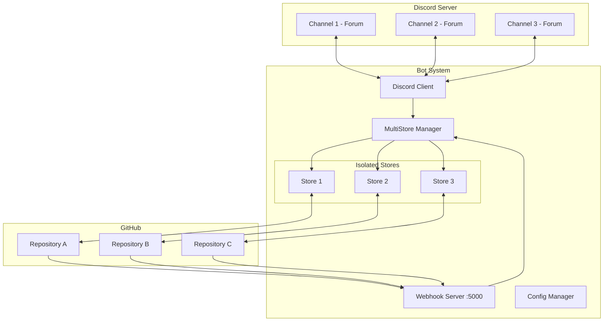
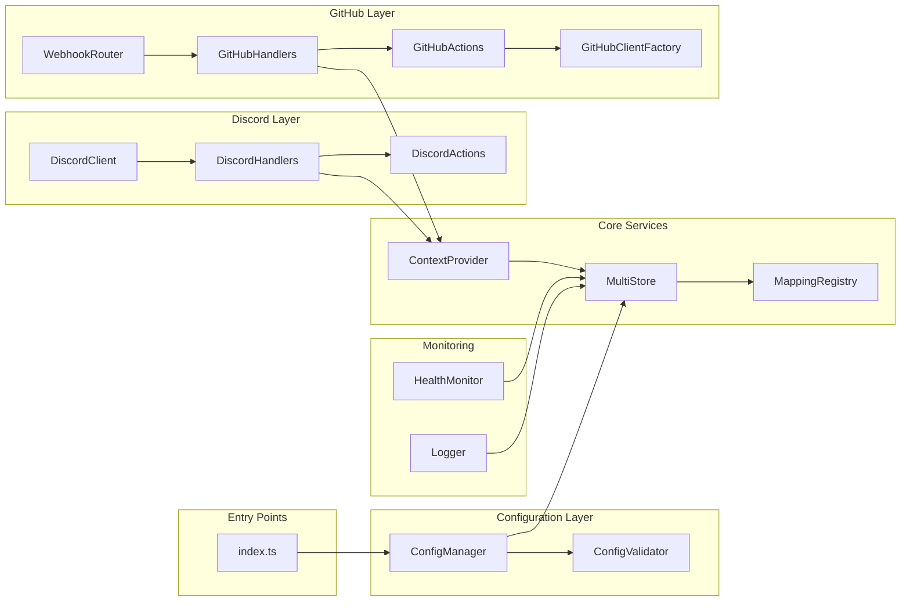

# Design Document

## Overview

This design document describes the technical architecture and implementation approach for enhancing the GitHub Issues Discord Threads Bot to support multiple repository-channel mappings. The system will be refactored from a single-repository architecture to a multi-tenant design where one bot instance can manage multiple GitHub repositories synchronized with different Discord channels.

The core challenge is maintaining complete isolation between different repository-channel pairs while sharing a single bot infrastructure. This design addresses configuration management, data isolation, event routing, and scalability concerns outlined in the requirements document.

Key design decisions:
- **Configuration-driven architecture**: JSON-based configuration replacing environment variables
- **Multi-tenant data stores**: Isolated store instances per mapping
- **Single webhook endpoint**: Repository identification from payload content
- **Context-based routing**: All operations carry mapping context
- **Fail-safe isolation**: Errors in one mapping don't affect others

## Architecture

### High-Level Architecture



### Component Architecture



### Data Flow Design

#### Discord to GitHub Flow
```
Discord Event → Channel ID Extract → Mapping Lookup → Store Selection → 
Context Creation → GitHub Action → Repository API Call → Store Update → Log
```

#### GitHub to Discord Flow
```
Webhook Receipt → Repository Extract → Mapping Lookup → Store Selection →
Context Creation → Discord Action → Channel API Call → Store Update → Log
```

## Components and Interfaces

### Core Components

#### ConfigManager
```typescript
interface ConfigManager {
  loadConfig(): Promise<BotConfig>;
  validateConfig(config: BotConfig): ValidationResult;
  getMappings(): RepositoryMapping[];
  getMapping(channelId: string): RepositoryMapping | undefined;
  getMappingByRepo(owner: string, repo: string): RepositoryMapping | undefined;
}
```

#### MultiStore
```typescript
class MultiStore {
  private stores: Map<string, Store>;
  private mappings: Map<string, RepositoryMapping>;
  
  initialize(mappings: RepositoryMapping[]): Promise<void>;
  getStore(mappingId: string): Store | undefined;
  getStoreByChannel(channelId: string): Store | undefined;
  getStoreByRepo(owner: string, repo: string): Store | undefined;
  getAllStores(): Map<string, Store>;
  
  // Thread operations
  addThread(mappingId: string, thread: Thread): void;
  removeThread(mappingId: string, threadId: string): void;
  getThread(mappingId: string, threadId: string): Thread | undefined;
}
```

#### MappingContext
```typescript
interface MappingContext {
  mapping: RepositoryMapping;
  store: Store;
  repoCredentials: RepoCredentials;
  logger: ContextualLogger;
}

interface ContextProvider {
  fromChannel(channelId: string): MappingContext | undefined;
  fromRepository(owner: string, repo: string): MappingContext | undefined;
  fromWebhook(payload: WebhookPayload): MappingContext | undefined;
}
```

#### WebhookRouter
```typescript
class WebhookRouter {
  constructor(private multiStore: MultiStore, private contextProvider: ContextProvider);
  
  handleWebhook(req: Request, res: Response): Promise<void>;
  validateSignature(payload: any, signature: string, secret: string): boolean;
  extractRepository(payload: WebhookPayload): { owner: string; repo: string };
  routeToHandler(action: string, context: MappingContext, payload: WebhookPayload): Promise<void>;
}
```

#### GitHubClientFactory
```typescript
class GitHubClientFactory {
  private clients: Map<string, Octokit>;
  
  getClient(context: MappingContext): Octokit;
  createIssue(context: MappingContext, data: IssueData): Promise<Issue>;
  createComment(context: MappingContext, issueNumber: number, body: string): Promise<Comment>;
  updateIssue(context: MappingContext, issueNumber: number, data: UpdateData): Promise<Issue>;
}
```

#### HealthMonitor
```typescript
interface HealthStatus {
  mappingId: string;
  channelId: string;
  repository: string;
  status: 'healthy' | 'degraded' | 'unhealthy';
  lastSync: Date;
  errorCount: number;
  metrics: MappingMetrics;
}

class HealthMonitor {
  getHealth(): HealthStatus[];
  getMappingHealth(mappingId: string): HealthStatus;
  recordSuccess(mappingId: string, operation: string): void;
  recordError(mappingId: string, error: Error): void;
  implementBackoff(mappingId: string): number;
}
```

### Modified Components

#### DiscordHandlers
```typescript
// Before
export async function handleThreadCreate(params: AnyThreadChannel) {
  if (params.parentId !== config.DISCORD_CHANNEL_ID) return;
  // ...
}

// After
export async function handleThreadCreate(params: AnyThreadChannel) {
  const context = contextProvider.fromChannel(params.parentId);
  if (!context) return; // Not a managed channel
  
  const { store, mapping } = context;
  // Use context for all operations
}
```

#### GitHubActions
```typescript
// Before
export async function createIssue(thread: Thread, params: Message) {
  const response = await octokit.rest.issues.create({
    owner: config.GITHUB_USERNAME,
    repo: config.GITHUB_REPOSITORY,
    // ...
  });
}

// After
export async function createIssue(thread: Thread, params: Message, context: MappingContext) {
  const client = githubClientFactory.getClient(context);
  const response = await client.rest.issues.create({
    owner: context.repoCredentials.owner,
    repo: context.repoCredentials.repo,
    // ...
  });
}
```

## Data Models

### Configuration Models

```typescript
interface BotConfig {
  discord_token: string;
  github_access_token: string;
  webhook_port: number;
  webhook_path?: string;
  log_level?: 'debug' | 'info' | 'warn' | 'error';
  health_check_interval?: number;
  mappings: RepositoryMapping[];
}

interface RepositoryMapping {
  id: string;                    // Unique identifier
  channel_id: string;             // Discord channel ID
  repository: {
    owner: string;                // GitHub username/org
    name: string;                 // Repository name
  };
  webhook_secret?: string;        // Optional webhook validation
  enabled: boolean;               // Enable/disable mapping
  options?: MappingOptions;       // Future extensibility
}

interface MappingOptions {
  sync_labels?: boolean;
  sync_assignees?: boolean;
  auto_close_stale?: number;
  custom_rules?: CustomRule[];
}
```

### Runtime Models

```typescript
interface Store {
  threads: Thread[];
  availableTags: GuildForumTag[];
  metrics: StoreMetrics;
  
  // Methods remain the same
  deleteThread(id: string): Thread[];
}

interface Thread {
  id: string;                    // Discord thread ID
  title: string;
  appliedTags: string[];
  number?: number;                // GitHub issue number
  body?: string;
  node_id?: string;              // GitHub node ID
  comments: ThreadComment[];
  archived: boolean | null;
  locked: boolean | null;
  lockArchiving?: boolean;
  lockLocking?: boolean;
  mappingId: string;             // NEW: Reference to mapping
}

interface StoreMetrics {
  threadCount: number;
  issueCount: number;
  lastSync: Date;
  syncErrors: number;
  operations: {
    created: number;
    updated: number;
    deleted: number;
    commented: number;
  };
}
```

### Webhook Models

```typescript
interface WebhookPayload {
  action: string;
  repository: {
    owner: {
      login: string;
    };
    name: string;
    full_name: string;
  };
  issue?: GitHubIssue;
  comment?: GitHubComment;
  sender: GitHubUser;
}

interface RepoCredentials {
  owner: string;
  repo: string;
}
```

## Error Handling

### Error Isolation Strategy

```typescript
class IsolatedErrorHandler {
  private errorCounts: Map<string, number> = new Map();
  private backoffTimers: Map<string, number> = new Map();
  
  async handleMappingError(mappingId: string, error: Error, context: MappingContext): Promise<void> {
    // Log with full context
    logger.error(`[${mappingId}] ${context.mapping.repository.owner}/${context.mapping.repository.name}`, error);
    
    // Update error count
    const count = (this.errorCounts.get(mappingId) || 0) + 1;
    this.errorCounts.set(mappingId, count);
    
    // Implement exponential backoff
    if (count > 3) {
      const backoff = Math.min(Math.pow(2, count) * 1000, 300000); // Max 5 minutes
      this.backoffTimers.set(mappingId, Date.now() + backoff);
    }
    
    // Update health status
    healthMonitor.recordError(mappingId, error);
    
    // Don't propagate - isolation boundary
    return;
  }
  
  canProcess(mappingId: string): boolean {
    const backoffUntil = this.backoffTimers.get(mappingId);
    if (!backoffUntil) return true;
    
    if (Date.now() > backoffUntil) {
      this.backoffTimers.delete(mappingId);
      this.errorCounts.set(mappingId, 0);
      return true;
    }
    
    return false;
  }
}
```

### Error Categories and Handling

| Error Type | Handling Strategy | Recovery |
|------------|------------------|----------|
| Configuration Error | Fail fast on startup | Manual fix required |
| Mapping Not Found | Log and ignore event | No action needed |
| API Rate Limit | Exponential backoff per mapping | Automatic retry |
| Network Error | Retry with backoff | Automatic recovery |
| Validation Error | Log and skip | Manual investigation |
| Store Corruption | Isolate mapping, alert | Rebuild from GitHub |
| Webhook Signature | Reject with 401 | Security alert |

### Resilience Patterns

```typescript
// Circuit Breaker per mapping
class MappingCircuitBreaker {
  private states: Map<string, 'closed' | 'open' | 'half-open'> = new Map();
  private failures: Map<string, number> = new Map();
  private lastFailure: Map<string, Date> = new Map();
  
  async execute<T>(mappingId: string, operation: () => Promise<T>): Promise<T> {
    const state = this.states.get(mappingId) || 'closed';
    
    if (state === 'open') {
      if (this.shouldAttemptReset(mappingId)) {
        this.states.set(mappingId, 'half-open');
      } else {
        throw new Error(`Circuit breaker open for mapping ${mappingId}`);
      }
    }
    
    try {
      const result = await operation();
      this.onSuccess(mappingId);
      return result;
    } catch (error) {
      this.onFailure(mappingId);
      throw error;
    }
  }
}
```

## Testing Strategy

### Unit Testing

```typescript
// Test configuration loading and validation
describe('ConfigManager', () => {
  it('should load valid JSON configuration', async () => {
    const config = await configManager.loadConfig();
    expect(config.mappings).toHaveLength(3);
  });
  
  it('should reject invalid configuration', () => {
    const invalid = { mappings: [{ channel_id: '123' }] }; // Missing repo
    expect(() => configManager.validateConfig(invalid)).toThrow();
  });
  
  it('should generate unique mapping IDs', () => {
    const ids = config.mappings.map(m => m.id);
    expect(new Set(ids).size).toBe(ids.length);
  });
});

// Test store isolation
describe('MultiStore', () => {
  it('should maintain isolated stores per mapping', () => {
    const store1 = multiStore.getStore('mapping1');
    const store2 = multiStore.getStore('mapping2');
    
    store1.threads.push(mockThread);
    expect(store2.threads).toHaveLength(0);
  });
  
  it('should handle store errors without affecting others', () => {
    jest.spyOn(store1, 'deleteThread').mockImplementation(() => {
      throw new Error('Store error');
    });
    
    expect(() => store1.deleteThread('123')).toThrow();
    expect(() => store2.deleteThread('456')).not.toThrow();
  });
});

// Test webhook routing
describe('WebhookRouter', () => {
  it('should route webhooks to correct mapping', async () => {
    const payload = {
      repository: { owner: { login: 'user1' }, name: 'repo1' }
    };
    
    const context = router.extractContext(payload);
    expect(context.mapping.id).toBe('mapping1');
  });
  
  it('should reject webhooks for unknown repositories', async () => {
    const payload = {
      repository: { owner: { login: 'unknown' }, name: 'unknown' }
    };
    
    const response = await router.handleWebhook(mockReq(payload), mockRes());
    expect(response.status).toBe(404);
  });
});
```

### Integration Testing

```typescript
// Test end-to-end synchronization per mapping
describe('Multi-Repository Synchronization', () => {
  beforeEach(() => {
    multiStore.initialize(testMappings);
  });
  
  it('should sync Discord thread to correct GitHub repo', async () => {
    const thread = await createDiscordThread(channel1);
    await waitForSync();
    
    const issue = await getGitHubIssue('owner1', 'repo1', 1);
    expect(issue.title).toBe(thread.name);
    
    const otherRepoIssues = await getGitHubIssues('owner2', 'repo2');
    expect(otherRepoIssues).toHaveLength(0);
  });
  
  it('should handle concurrent events across mappings', async () => {
    const promises = [
      createDiscordThread(channel1),
      createDiscordThread(channel2),
      createDiscordThread(channel3)
    ];
    
    await Promise.all(promises);
    await waitForSync();
    
    expect(await getGitHubIssues('owner1', 'repo1')).toHaveLength(1);
    expect(await getGitHubIssues('owner2', 'repo2')).toHaveLength(1);
    expect(await getGitHubIssues('owner3', 'repo3')).toHaveLength(1);
  });
});
```

### Performance Testing

```typescript
// Test scalability with multiple mappings
describe('Performance', () => {
  it('should handle 10 mappings within memory limits', async () => {
    const initialMemory = process.memoryUsage().heapUsed;
    
    await multiStore.initialize(generate10Mappings());
    await populateWithTestData();
    
    const finalMemory = process.memoryUsage().heapUsed;
    const memoryIncrease = (finalMemory - initialMemory) / 1024 / 1024; // MB
    
    expect(memoryIncrease).toBeLessThan(512);
  });
  
  it('should maintain sub-2s response time', async () => {
    const start = Date.now();
    
    await Promise.all([
      handleDiscordEvent(mockThreadCreate),
      handleGitHubWebhook(mockIssueCreate)
    ]);
    
    const duration = Date.now() - start;
    expect(duration).toBeLessThan(2000);
  });
});
```

### Security Testing

```typescript
// Test webhook signature validation
describe('Security', () => {
  it('should validate webhook signatures when configured', () => {
    const payload = JSON.stringify({ test: 'data' });
    const secret = 'webhook_secret';
    const signature = createHmacSignature(payload, secret);
    
    expect(router.validateSignature(payload, signature, secret)).toBe(true);
    expect(router.validateSignature(payload, 'wrong', secret)).toBe(false);
  });
  
  it('should not leak sensitive data in logs', () => {
    const spy = jest.spyOn(logger, 'info');
    
    configManager.loadConfig();
    
    expect(spy).not.toHaveBeenCalledWith(
      expect.stringContaining('discord_token')
    );
  });
});
```

### Health Check Testing

```typescript
// Test monitoring and health checks
describe('Health Monitoring', () => {
  it('should track health status per mapping', () => {
    const health = healthMonitor.getHealth();
    
    expect(health).toHaveLength(3);
    expect(health[0].status).toBe('healthy');
  });
  
  it('should degrade status after errors', () => {
    healthMonitor.recordError('mapping1', new Error('Test'));
    healthMonitor.recordError('mapping1', new Error('Test'));
    healthMonitor.recordError('mapping1', new Error('Test'));
    
    const health = healthMonitor.getMappingHealth('mapping1');
    expect(health.status).toBe('degraded');
  });
});
```

## Implementation Notes

### Migration Path
1. Create new configuration structure alongside existing code
2. Implement MultiStore wrapper around existing Store
3. Add context passing to all handlers
4. Switch to JSON configuration
5. Remove environment variable code

### Performance Considerations
- Lazy load stores only when needed
- Cache Discord channel data per mapping
- Use connection pooling for GitHub API
- Implement request batching where possible

### Security Considerations
- Never log tokens or secrets
- Validate all webhook signatures when configured
- Sanitize user input in issue/comment bodies
- Use least privilege for API tokens

### Future Enhancements
- Database persistence layer
- Web UI for configuration management
- Dynamic mapping management via Discord commands
- Custom sync rules per mapping
- Metrics dashboard